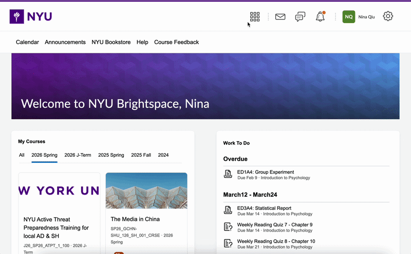
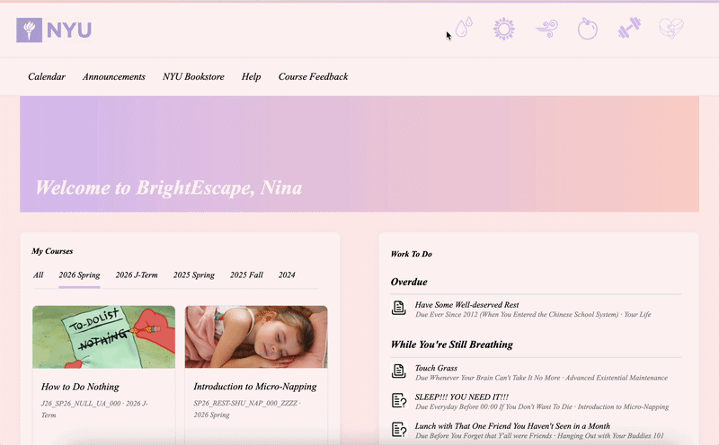

# BrightEscape
A Calming Alternative to Academic Struggles.

## Description
BrightEscape redesigned the NYU LMS system Brightspace to be a space that encourages rest instead of productivity. By replacing deadlines with self-care tasks and stress with pastel calmness, the website invites users to pause, breathe, and escape the pressure of constant performance.

## Abstract
If you ask about a website every NYU student knows, it would probably be Brightspace, the course management platform often associated with deadlines, evaluation, and the constant pressure to keep up. But sometimes, don't you just want to slow down and for once, allow some time for yourself? By altering the visual language and behavior of this familiar interface, this project reimagines a space built for productivity as one that encourages pause, rest, and disengagement. Tasks lead nowhere, notifications suggest basic needs, and interactions reward inactivity rather than efficiency. Through humor and exaggeration, the work highlights the tension between institutional expectations and personal well-being. Soft colors, slowed interactions, and absurd course content contrast with the urgency of academic dashboards, inviting viewers to reflect on how digital platforms shape their stress, their habits, and their sense of what it means to be doing enough.

## Sneak Peeks
First up, we have the original homepage of NYU Brightspace, almost exactly recreated. UGH, STRESS......

And here is the beautiful new skin for it, BrightEscape, where you can breathe and rest on a calming interface.

All the course tabs are clickable, come and [see what they do](https://nina-qiu.github.io/CommLab/shanzhai-website/)!