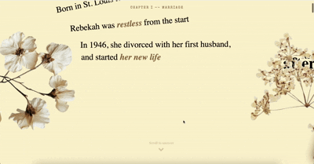
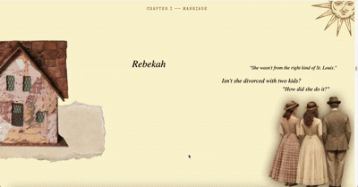

# And They Said

### A Scroll-Through Story of Gossip, Old Money, and the Woman Behind the Rumors

**By Nina Qiu**

An interactive web narrative about a real woman whose life became legend — told through the voices of everyone who wasn't her. Scroll to watch the story unfold, and discover what happens when history is written by people who were watching from the outside.

## Abstract

This project adapts the story of Rebekah Harkness — oil heiress, arts patron, and subject of a century's worth of rumors — as told through Taylor Swift's *The Last Great American Dynasty* from the album *folklore*. The source material is not conventional biography but something closer to collective memory: a story that survives through the things other people said about it.

The translation into the web leans into scroll as a narrative force. Rather than presenting information on a page, the reader's downward gesture becomes the passage of time itself — a train crossing a screen, a wedding assembling, a life accelerating toward its end. Characters appear and disappear. The background shifts. The gossip surfaces only when you reach for it.

The key idea is that rumor is a form of storytelling. This piece does not ask you to judge whether Rebekah's choices were right or wrong. It asks you to notice that you are hearing her story through other people's mouths, and that this has always been the only version available.

## Sneak Peeks
Rebecca rode up on the afternoon train.

The wedding was charming if a little gauche.

Come and [uncover the whole story](https://nina-qiu.github.io/CommLab/D-final-project-copy)!
